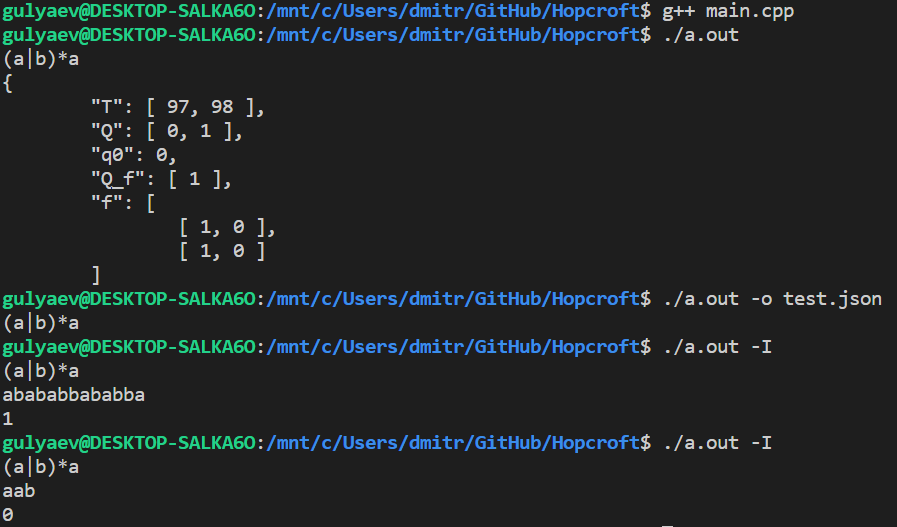

# Minimal DFA from regex

## how to use

Compile code into executable like so:
```
g++ main.c
```

Then run program. Input regular expression (cin).
The output is json-compatible form of minimal dfa
resolving the regular language given.

We modificate a program from source in python in order to visualize automata. You can run it like so:
```
python script.py
```

## Project structure

### common
Common functions for both AST parsing and Automata
creation/execution are declared in `common.hpp` and
defined in `common.cpp`.
Those are just helper functions, which do not have any significant practical implications.

#### functions:
* `enum ASTNodeType` - define Node type in AST;


* `std::vector<int> concat(
   std::vector<int> a, 
   std::vector<int> b);` - concat 
   2 vectors and remove duplicates
 
* defines AST Node and connections with children. Remember the characteristics of Node(value, first pos, last pos, nullable):
```c++ 
  typedef struct AST {
    ASTNodeType type;
    int value;
    struct AST *left, *right;
    std::vector<int> fpos, lpos;
    bool nullable;
} AST;
```


### AST
Ast parsing of regular expression is done in `AST.cpp`
(definitions in `AST.hpp`).
You can see there constructor functions like:
```c++
AST* createLeaf(int val);
AST* createHash();
AST* createStar(const char* content);
AST* createOr(const char* left, const char* right);
AST* createCat(
  const char* left,
  const char* right,
  bool isHash
);
AST* fromString(const char* str);
AST* fromREGEX(const char* regex);
```

Those functions recursively call each other.
`fromString` determines sequence of nodes and
passes substrings into node-specific constructors.

There are also helper functions defined
(like followpos calculation) as well as `printAST`
used for debugging.

#### Other functions:
* `printAST` - prints AST into std::cout;
* `alphabet` - recursively adds AST leaf Nodes' symbols into vector<int>;
* `putinmap` - adds Node's value to a map: [positions] → [values]. Recursively calls itself if not at a leaf Node;
* `CharValueMap` - creates map and calls `putinmap` on a root;
* `computeFpos` - recursively fills in followpos table;
* `FollowPos` - creates table and calls `computeFpos` on a root.
### Automata
In order to build and test DFA there are
`Automata.hpp` with definitions and `Automata.cpp`
with realisation of the Automata class.
It has method `test` to check whether
word fits in the language or not.
There is also `match` method that can be used in
real-world applications to search for text (as an 
example).

#### Automata class
Has properties:
* `T` - alphabet;
* `Q` - states;
* `q0`- start state;
* `Q_f`- final state;
* `f` - lookup table of transition function;
* `test` - function to check if a word is accepted by given Automata;
* `match` - find the first acceptabe substring of a word. Returns a pointer to a substring's end.

#### Other functions:
* `fromAST` - creates DFA based on AST. Takes it's `alphabet`, `CharValueMap`, `FollowPos` 

### Minimization
This module emplements Hopcroft Algorithm and it is based on partitioning indistinguishable states. 

* `eq` - checks if partitions are equal (deep equality)
* `areInSame` - checks is two states are in same partition
* `push` - pushes state into partition
* `pushIfFree` - pushes state only once (makes sure that one state is present only in one partition) 
* `add` - adds to states into different or same partition based on boolean variable
* `minimize` - runs Hopcroft algotithm on the automata given, returns minimized automata


## Scientific reference

* converting regex to DFA - https://www.geeksforgeeks.org/regular-expression-to-dfa/
* minimization algorithm - https://geeksforgeeks.org/minimization-of-dfa
* vector concatenation function - https://github.com/ckshitij/RE_TO_DFA/blob/master/RE_TO_DFA.cpp#L14

* program for visualization - https://github.com/nefanov/fltp/blob/main/p1/examples/transform/json_visualize_fa.py
